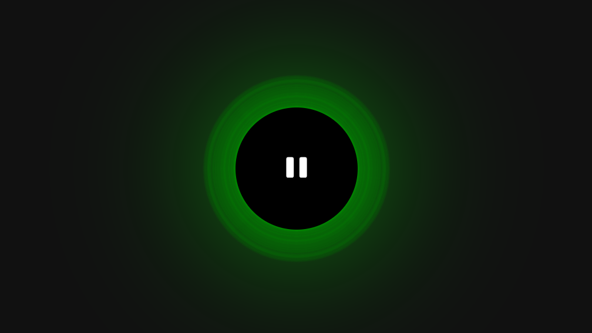

# Vuesik

A simple application to play music on a browser to learn Vue.js

# Todo

- [x] fix cursor not being recovered after selecting a file
- [x] fix slight difference between hovering cursor and player circle
- [x] use pinia to handle the global state instead of window object
- [x] refactor and move the cursor stick/unstick behavior into helper funcs
